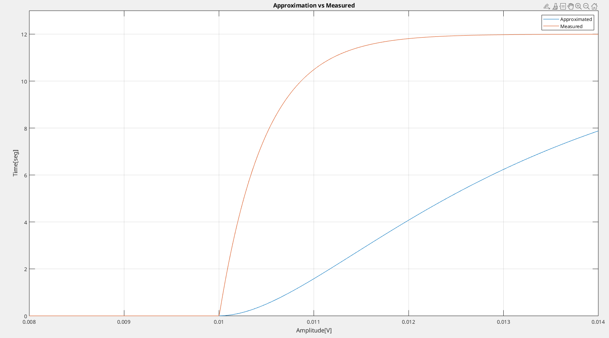

# Actividad Práctica 1

## Ítem 2

En el archivo Curvas_Medidas_RLC_2025.xls (datos en la hoja 1 y etiquetas en la hoja 2) están las series de datos que sirven para deducir los valores de R, L y C del circuito. Emplear el método de la respuesta al escalón, tomando como salida la tensión en el capacitor.

### A Resolver

Se selecciona un tiempo inicial $t_{inic}= 0.01seg$ con un incremento de $t= 2ms$. En valores de posición de array esto es $t(1001)= 0.01seg$ con incrementos/pasos de $h= 200 \, posiciones$. Esto es:

$$ y_{1}(0.012seg)= 11.81V$$    
$$ y_{2}(0.014seg)= 11.99V$$
$$ y_{3}(0.016seg)=  11.99V$$

Se obtiene una respuesta al escalón con una constante de tiempo mas lenta del sistema.



Con valores de tiempo que resultan imágenes de valor de tensión cercanos a la ganancia en estado de régimen se tiene que los valores de las constantes de tiempo estimadas $T_{1}, \, T_{2}$ son complejos (No es válido para la Función Transferencia del caso).

#### Corrección

Se toman valores de tiempo $t_{1}, t_{2}, t_{3}$ de forma tal de obtener valores de tensión con mayor diferencia entre ellos. Se toma los siguientes valores:

|       |$t$ [seg]|Amplitud [V]|
|:-----:|:-------:|:----------:|
|Punto 1|0.0107   |9.351       |
|Punto 2|0.0113   |11.1545     |
|Punto 3|0.0118   |11.73       |

Se obtiene una mejor aproximación de la respuesta al escalón.


Al almacenar los valores de tiempo y amplitud se obtienen valores complejos con la siguiente instrucción (duda):

```matlab
% Obtain step response of approximated Transfer Function.
[ys, ts]= step(sys*exp(-s*0.01), 'r-', 0.16);
```

#### Dudas

- Qué significaría obtener valores complejos?

Problema en el modelo del sistema o configuración de la simulación. Se puede tener un sistema inestable, por lo que se verifica mediante la obtención de los polos de la función transferencia aproximada.

Se tiene que la función transferencia es la siguiente:


`Se tiene valores imaginarios pero buena aproximación en la respuesta del escalón`.

<!--Se implementa `stepinfo(sys)`, `stepdata(sys)`. -->

Se fuerza valores reales con el comando `real()`.

```matlab
% Save step response data.
tab= [real(ts), real(ys)];
```


